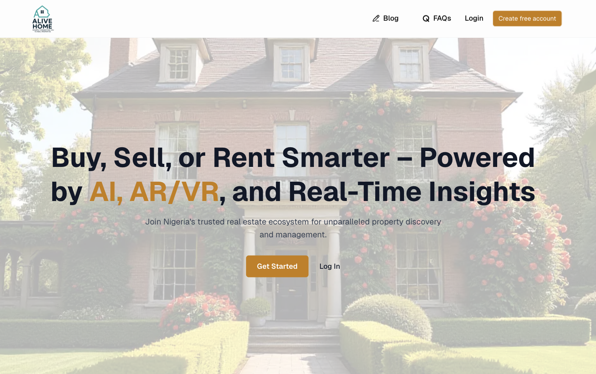

<div align="center">
<h1>Alive Home Application</h1>
<h6><i>Manage your Client with Alive Home Application</i></h6>
<hr />
</div>

Alive Home is an AI-driven real estate technology platform that leverages proximity-based services, geotechnology, and interactive tools to transform how Nigerians buy, sell, and rent properties. It connects homeowners, developers, realtors, and buyers in real time, reducing fraud, improving decision-making, and increasing access to verified housing information.

# 🏗️ Tech Stack

- **Framework**: [Next.js 15](https://nextjs.org/) with App Router
- **Styling**: [Tailwind CSS 4](https://tailwindcss.com/)
- **Authentication**: [NestJs](https://nestjs.com/) [NextAuth](https://next-auth.js.org/)
- **Database**: [Mongodb Database](https://account.mongodb.com/) [Prisma ORM](https://www.prisma.io/)
- **React TanStack Query**: [React Tanstack Query](https://tanstack.com/query/latest)
- **React TanStack Table**: [React Tanstack Query](https://tanstack.com/table/v8)
- **AI Models**: [Vercel AI SDK](https://ai-sdk.dev/) (openai models, gemini models)
- **Framer Motion**: [Framer Motion](https://motion.dev/docs)
- **React-Hook Form**: [Redux Hook Form](https://react-hook-form.com)
- **React-Redux**: [Redux Toolkit](https://redux-toolkit.js.org/)
- **Icons**: [Lucide React](https://lucide.dev/)

# 🎯 Prototype



# 🚀 How to Contribute

### 1. Clone the Repository

```bash
git clone https://github.com/AliveInnovationTech/alive-home-frontend.git
cd alive-frontend
```

### 2. Install Dependencies

```bash
npm install
```

### 3. Environment Setup

Create a `.env` file in the project root:

```env
# Site Information (Optional)
NODE_ENV="development"
NEXT_PUBLIC_BASEURL="backendurl goes here"
NEXT_PUBLIC_APP_URL=https://alive-home.vercel.app

# Next-Auth Config
NEXTAUTH_SECRET=your_nextauth_secrete
NEXTAUTH_URL=https://alive-home.vercel.app
NEXTAUTH_DEBUG=true


# OpenAI API & Gemini API Key
OPENAI_API_KEY=alivehome_openai_api_key
GEMINI_API_KEY=alivehome_gemini_api_key
```

### 4. Start Development Server

```bash
npm run dev
```

Visit [http://localhost:3000](http://localhost:3000) to see your application running!

# Deployment

AWS Amplify was used to deploy the app.

- [Vercel](https://vercel.com/)
- [AWS AMPLIFY](https://us-east-1.console.aws.amazon.com/amplify)

# License

The MIT License - Copyright (c) 2025 - Present, Alive Home / Storage Service.

## 🆘 Support

- **Vercel AI-SDK**: [Vercel AI-SDK Documentation](https://ai-sdk.dev/docs/introduction/)
- **NextAuth**: [Appwrite Documentation](https://next-auth.js.org/)

## 🙏 Acknowledgments

- [Next.js](https://nextjs.org) for Frontend
- [Vercel AI-SDK](https://ai-sdk.dev/) for AI model access
- [ExpressJs](https://nestjs.com/) for backend services
- [Tailwind CSS](https://tailwindcss.com)
- [Lucide](https://lucide.dev) for icons
- [NextAuth](https://next-auth.js.org/)

## Built by

- [Rasheed Olatunde](https://github.com/olatunde1998) (Software Developer)
